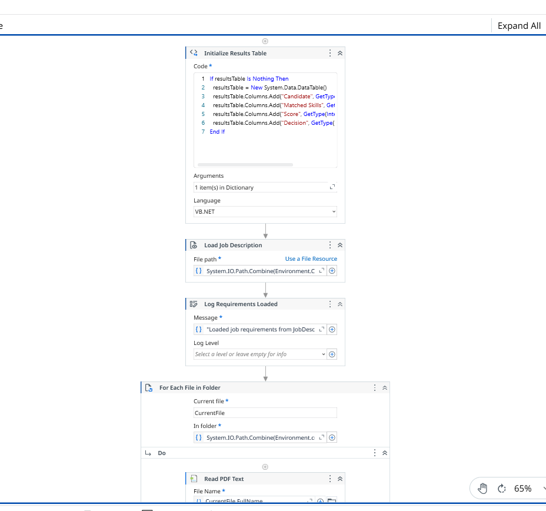
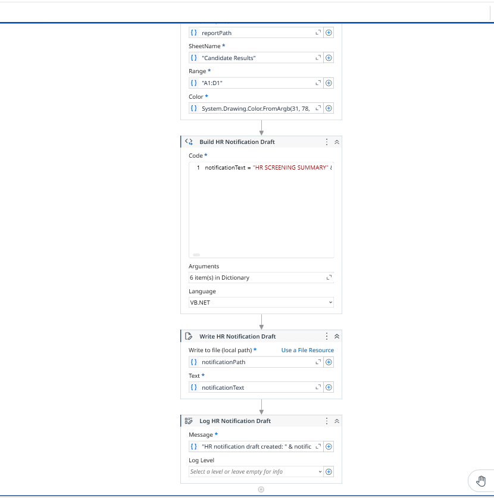

# Resume Screening Automation

An automated resume screening workflow built with UiPath to streamline the initial recruitment process by extracting candidate information and matching resumes with job requirements.

## Project Overview

Recruiters often spend significant time manually reviewing resumes and checking candidate skills against job requirements.

This project automates the initial resume screening process using UiPath.

## Key Features

- Automated resume processing
- Candidate information extraction
- Skill and requirement matching
- Candidate screening and scoring
- Structured screening results
- Automated workflow using UiPath
- Organized input and output handling

## Technologies Used

- UiPath Studio
- VB.NET
- PDF Automation
- Excel Activities
- DataTables
- File and Folder Automation

## Workflow

Job Description  
↓  
Read Requirements  
↓  
Process Resumes  
↓  
Extract Candidate Information  
↓  
Match Skills and Requirements  
↓  
Calculate Screening Score  
↓  
Generate Candidate Results

## Project Structure

```text
resume-screening-automation/
│
├── Main.xaml
├── project.json
├── project.uiproj
├── entry-points.json
├── JobDescription.txt
├── docs/
├── outputs/
└── resumes/

## Workflow

### Main Workflow



### Reporting and Notification


